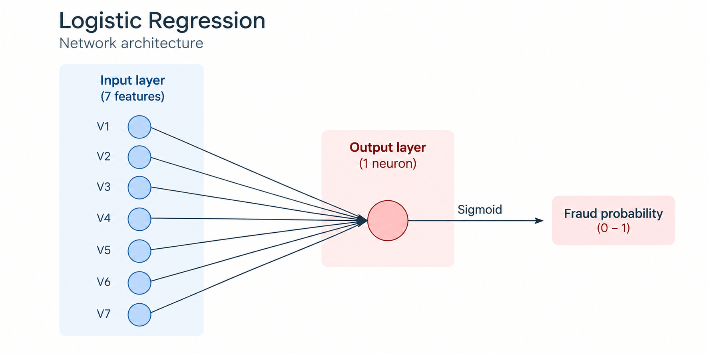
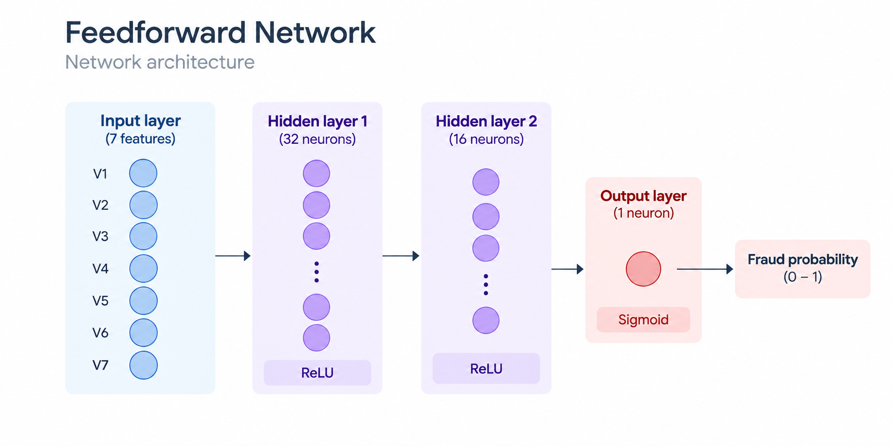
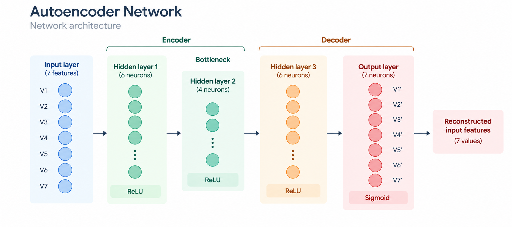
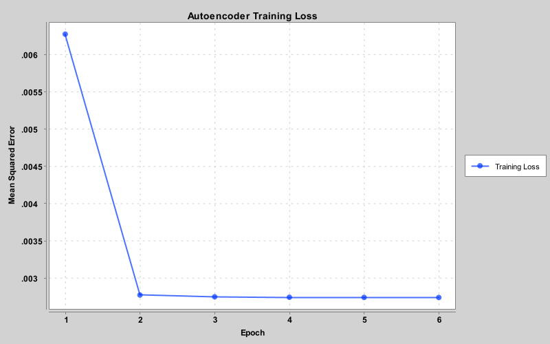

# Credit Card Fraud Detection with Deep Netts

A practical Java-first introduction to fraud detection with **Deep
Netts**.

This project demonstrates three different ways to approach credit card
fraud detection in Java:

-   **Logistic Regression** - a simple and interpretable baseline for
    binary classification.
-   **Feedforward Neural Networks** - supervised neural networks that
    learn non-linear fraud patterns.
-   **Autoencoder** - an anomaly-detection approach that learns normal
    transaction behavior and identifies transactions that are difficult
    to reconstruct.

The examples are designed as a **cookbook and starting point for Java
developers**, including developers with little or no previous machine
learning experience. The goal is not only to run a trained model, but to
make the complete workflow understandable: loading data, preparing it,
defining a network, training it, evaluating it, experimenting with it,
and adapting the code to another dataset.

> **If you are new to machine learning**: Deep Netts follows a workflow
> that should feel familiar to Java developers. You define the model
> inputs and architecture, configure the training process, provide the
> data, train the model, and evaluate the results.

------------------------------------------------------------------------

## Contents

1.  [What You Will Learn](#what-you-will-learn)
2.  [Deep Netts Installation](#deep-netts-installation)
3.  [Running the Examples](#running-the-examples)
4.  [Project Structure](#project-structure)
5.  [The Fraud Detection Problem](#the-fraud-detection-problem)
6.  [Datasets](#datasets)
7.  [Data Preparation](#data-preparation)
8.  [Logistic Regression](#1-logistic-regression)
9.  [Feedforward Neural Network](#2-feedforward-neural-network)
10. [Batch Training](#3-batch-training)
11. [Autoencoder for Anomaly Detection](#4-autoencoder-for-anomaly-detection)
12. [Model Evaluation](#model-evaluation)
13. [Results](#results)
14. [Experimenting with the Models](#experimenting-with-the-models)
15. [Using Your Own Dataset](#using-your-own-dataset)
16. [Business and Financial Interpretation](#business-and-financial-interpretation)
17. [Key Takeaways](#key-takeaways)

------------------------------------------------------------------------

## What You Will Learn

By following the examples, you will see how to:

-   load and inspect transaction data from CSV files;
-   select input features and the target column;
-   preserve the fraud/non-fraud ratio with a stratified train/test
    split;
-   scale numerical inputs before training;
-   build neural networks with the Deep Netts fluent builder API;
-   configure learning rate, stopping criteria, early stopping and batch
    training;
-   evaluate classification models using precision, recall and F1 score
    instead of relying only on accuracy;
-   use an autoencoder for anomaly detection;
-   calibrate an anomaly threshold without using the final test set;
-   adapt the same project structure to another binary fraud-detection
    dataset.

------------------------------------------------------------------------

# Deep Netts Installation

The project uses Deep Netts for model creation and training. The
required dependencies are already defined in `pom.xml`, but the setup
depends on which Deep Netts features you want to use.

## Deep Netts Core

The examples use the Deep Netts Core library for defining, training and
evaluating neural networks.

The project currently includes the following dependency:

``` xml
<dependency>
    <groupId>com.deepnetts</groupId>
    <artifactId>deepnetts-core-pro</artifactId>
    <version>4.0.0</version>
</dependency>
```

For examples that do not require the additional features of the Pro
version, the open-source Deep Netts Core edition can also be used.

## Vector API

Deep Netts can use the JDK Vector API to accelerate numerical
operations. Vector API support is optional and can be enabled after
running the examples with the standard configuration.

To use it, first download the [Deep Netts Free
Edition](https://www.deepnetts.com/download/).

After downloading and extracting the package, import the provided Deep
Netts libraries into your local Maven repository. The downloaded
distribution includes the libraries required for Vector API support and
the Deep Netts license.

The project uses the following dependencies:

``` xml
<dependency>
    <groupId>com.deepnetts</groupId>
    <artifactId>deepnetts-vector</artifactId>
    <version>4.0.0</version>
</dependency>

<dependency>
    <groupId>com.deepnetts</groupId>
    <artifactId>deepnetts-license</artifactId>
    <version>1.0</version>
</dependency>
```

These dependencies are already included in this project's `pom.xml`.
However, the corresponding JAR files must first be imported from the
downloaded Deep Netts distribution so that Maven can resolve them
locally.

The Deep Netts download provides scripts for importing the required
libraries and license into the local Maven repository:

**Windows**

``` text
ImportToLocalMaven.bat
```

**Linux / macOS**

``` text
importToLocalMaven.sh
```

After the import, the Deep Netts artifacts should be available in the
local Maven repository:

``` text
~/.m2/repository/com/deepnetts/
```

For the complete download and installation procedure, see the [official
Deep Netts Quick Start guide](https://www.deepnetts.com/quickstart/).

## Enabling Vector API in the Examples

The examples can first be run without Vector API enabled. This provides
a baseline training time.

To enable Vector API support, uncomment:

``` java
DeepNetts.getInstance().setUseVectorAPI(true);
```

Run the same model again and compare the training time. Keep the
dataset, network architecture and training configuration unchanged so
that Vector API usage is the only change in the experiment.

------------------------------------------------------------------------

# Running the Examples

## Requirements

The examples were developed and tested with **JDK 25**.

NetBeans is configured to use the JDK 25 platform:

``` text
<netbeans.hint.jdkPlatform>JDK_25</netbeans.hint.jdkPlatform>
```

The Maven project compiles the source with:

``` xml
<maven.compiler.release>17</maven.compiler.release>
```

This means that JDK 25 is used as the development/runtime JDK, while
Maven targets Java 17-compatible class files.

The project uses Deep Netts 4.0.0 dependencies together with DFLib CSV
support.

The project also enables the JDK incubator Vector API. The configured
JVM arguments are:

``` text
--add-modules jdk.incubator.vector --enable-native-access=ALL-UNNAMED
```

If running from NetBeans, these arguments are already present in the
project run configuration.

## Build

From the project directory:

``` bash
mvn clean install
```

## Choose an example

The executable examples are ordinary Java classes with `main` methods:

``` text
CreditCardFraudLogisticRegression
CreditCardFraudFFNetwork
CreditCardFraudFFNetworkBatch
CreditCardFraudBalancedFF
CreditCardFraudBalancedFFBatch
CreditCardFraudAutoencoder
```

Run the class you want to explore.

A useful learning order is:

``` text
Logistic Regression
        ↓
Feedforward Network
        ↓
Batch Feedforward Network
        ↓
Autoencoder
```

This moves from the simplest supervised model to a non-linear neural
network, then batch training, and finally anomaly detection.

## Generated prepared data

Train/test CSV files created during preprocessing are written under:

``` text
target/prepared-data/
```

They are generated artifacts rather than source datasets.

------------------------------------------------------------------------

## Project Structure

The project separates **data configuration and preparation** from
**model implementations**.

``` text
src/main/java/com/deepnetts/examples/frauddetection/
│
├── data/
│   ├── DatasetConfig.java
│   ├── FraudDatasetConfigs.java
│   └── DataPreparation.java
│
├── models/
│   ├── CreditCardFraudLogisticRegression.java
│   ├── CreditCardFraudFFNetwork.java
│   ├── CreditCardFraudFFNetworkBatch.java
│   ├── CreditCardFraudBalancedFF.java
│   ├── CreditCardFraudBalancedFFBatch.java
│   └── CreditCardFraudAutoencoder.java
│
└── util/
    ├── MarkdownReport.java
    └── TrainingLossChart.java

src/main/resources/data/
├── credit_card_fraud_balanced.csv
└── credit_card_fraud_imbalanced.csv

docs/images/
├── logistic-regression-architecture.png
├── feedforward-network-architecture.png
├── autoencoder-architecture.png
└── autoencoder-training-loss.png
```

The separation is intentional:

``` text
DatasetConfig  →  DataPreparation  →  Model
   WHAT               HOW             LEARNING
```

`DatasetConfig` describes **which data to use**.\
`DataPreparation` contains reusable preprocessing logic.\
Classes in `models` define **how the model learns from the prepared
data**.

This keeps dataset-specific information out of the neural-network code
and makes the examples easier to reuse.

The `util` package contains supporting functionality for generating
training-loss visualizations and Markdown result reports.

------------------------------------------------------------------------

# The Fraud Detection Problem

Fraud detection is a **binary classification** problem:

``` text
0 → legitimate transaction
1 → fraudulent transaction
```

For supervised models, each training example contains:

``` text
transaction features → known fraud label
```

The model learns a function that maps transaction characteristics to a
fraud prediction.

Fraud detection also introduces an important practical problem: real
transaction data is usually **imbalanced**. Legitimate transactions
greatly outnumber fraudulent ones. A model can therefore achieve high
accuracy while still missing many fraud cases.

For this reason, the examples report metrics such as **precision, recall
and F1 score** in addition to accuracy.

------------------------------------------------------------------------

# Datasets

Two datasets are used in the project to explore different fraud
detection scenarios.

## Imbalanced transaction dataset

File:

``` text
src/main/resources/data/credit_card_fraud_imbalanced.csv
```

It contains **1,000,000 transactions** with seven input features and one
binary target.

  ---------------------------------------------------------------------
  Input feature                      Description
  ---------------------------------- ----------------------------------
  `distance_from_home`               Distance between the transaction
                                     and the cardholder's home

  `distance_from_last_transaction`   Distance from the previous
                                     transaction

  `ratio_to_median_purchase_price`   Purchase amount relative to the
                                     cardholder's median purchase

  `repeat_retailer`                  Whether the transaction is at a
                                     previously used retailer

  `used_chip`                        Whether the card chip was used

  `used_pin_number`                  Whether a PIN was used

  `online_order`                     Whether the transaction was made
                                     online
  ---------------------------------------------------------------------

Target:

``` text
fraud
```

Observed class distribution:

  Class         Transactions    Share
  ----------- -------------- --------
  Non-fraud          912,597   91.26%
  Fraud               87,403    8.74%

## Balanced transaction dataset

File:

``` text
src/main/resources/data/credit_card_fraud_balanced.csv
```

It contains **1,000,000 transactions**, six input features and an
exactly balanced target distribution.

  -------------------------------------------------------------------------
  Input feature                             Description
  ----------------------------------------- -------------------------------
  `amount`                                  Transaction amount

  `is_cross_border`                         Whether the transaction is
                                            cross-border

  `attempts_last_30min`                     Number of recent transaction
                                            attempts

  `minutes_since_previous_transaction`      Time since the previous
                                            transaction

  `distance_from_previous_transaction_km`   Distance from the previous
                                            transaction

  `different_merchants_last_30min`          Number of different merchants
                                            recently used
  -------------------------------------------------------------------------

Target:

``` text
fraud_label
```

Class distribution:

``` text
500,000 non-fraud
500,000 fraud
```

> The two datasets do not contain the same features or class
> distribution. Their metrics should therefore not be interpreted as a
> controlled model-to-model benchmark.

------------------------------------------------------------------------

# Data Preparation

All examples begin in the same way:

``` java
DatasetConfig config = FraudDatasetConfigs.IMBALANCED_DATASET_CONFIG;
DataPreparation dataPreparation = new DataPreparation(config);
```

The configuration provides:

``` java
csvFile
inputColumns
targetColumn
```

`DataPreparation` then loads the CSV with DFLib and provides reusable
inspection and splitting operations.

## Inspecting the data

Each main example prints the same basic information:

``` java
dataPreparation.printDataSetShape();
dataPreparation.printColumnInfo();
dataPreparation.previewRows(5);
dataPreparation.printSelectedColumns();
dataPreparation.printTargetDistribution();
```

Before training a model, this answers several basic questions:

-   How many rows and columns were loaded?
-   Which columns are present?
-   Are values missing?
-   Which features will actually be used by the model?
-   How imbalanced is the target?

This is a useful habit in any machine learning workflow: **understand
the data before training the model**.

## Stratified train/test split

The supervised examples use an 80/20 split:

``` java
private static final double TRAIN_RATIO = 0.8;
private static final long RANDOM_SEED = 42;
```

Instead of randomly splitting all rows together, `DataPreparation`
performs a **stratified split**.

In simplified form:

``` text
fraud rows     ──┬── 80% train
                 └── 20% test

non-fraud rows ──┬── 80% train
                 └── 20% test
```

This preserves approximately the same class distribution in both sets.
That matters when fraud represents only a small part of all
transactions.

The fixed random seed makes the split reproducible.

## Feature scaling

After loading the prepared training and test CSV files:

``` java
MaxScaler scaler = DataSets.scaleToMax(trainingSet);
scaler.apply(testSet);
```

The scaler is fitted on the **training set** and then applied to the
test set.

This distinction is important. Information from the test set should not
influence how the training data is prepared.

------------------------------------------------------------------------

# 1. Logistic Regression

Class:

``` text
CreditCardFraudLogisticRegression
```

Logistic regression provides the simplest supervised baseline in the
project.

Although the model is created using `FeedForwardNetwork`, it contains
**no hidden layers**:

``` java
FeedForwardNetwork logisticRegression = FeedForwardNetwork.builder()
        .addInputLayer(numInputs)
        .addOutputLayer(numOutputs, ActivationType.SIGMOID)
        .lossFunction(LossType.CROSS_ENTROPY)
        .build();
```

For the imbalanced dataset, the architecture is:

``` text
7 inputs → 1 sigmoid output
```

The output can be interpreted as the model's fraud score for the
transaction.



> **Architecture shown in the diagram:** The model uses seven input features connected directly to a single output neuron with Sigmoid activation. The number of input features depends on the selected dataset.

### Why sigmoid?

The sigmoid activation maps the output to a value between 0 and 1, which
is appropriate for a binary decision such as:

``` text
fraud / non-fraud
```

### Why cross-entropy?

Cross-entropy measures how well the predicted binary output agrees with
the known target during training. The trainer adjusts model parameters
to reduce this loss.

### Training configuration

``` java
logisticRegression.getTrainer()
        .setLearningRate(0.01f)
        .setStopError(0.13f)
        .setStopEpochs(200)
        .setShuffle(true)
        .setEarlyStopping(true)
        .setEarlyStoppingPatience(15)
        .setEarlyStoppingMinLossChange(0.00001f);
```

The important parameters are:

  ---------------------------------------------------------------------
  Parameter                          Meaning
  ---------------------------------- ----------------------------------
  `learningRate`                     Controls the size of each
                                     parameter update

  `stopError`                        Stops training if the training
                                     error becomes sufficiently small

  `stopEpochs`                       Maximum number of complete passes
                                     through the training data

  `shuffle`                          Changes training-example order
                                     between epochs

  `earlyStopping`                    Stops when additional training is
                                     no longer producing meaningful
                                     improvement
  ---------------------------------------------------------------------

### Why start here?

A simple baseline answers an important question:

> Does a more complex neural network actually provide a useful
> improvement over a linear decision boundary?

Starting with the simplest reasonable model makes later experiments
easier to interpret.

------------------------------------------------------------------------

# 2. Feedforward Neural Network

Class:

``` text
CreditCardFraudFFNetwork
```

The standard feedforward example adds hidden layers so the model can
learn **non-linear combinations of transaction features**.

``` java
FeedForwardNetwork neuralNet = FeedForwardNetwork.builder()
        .addInputLayer(numInputs)
        .addFullyConnectedLayer(32, ActivationType.RELU)
        .addFullyConnectedLayer(16, ActivationType.RELU)
        .addOutputLayer(numOutputs, ActivationType.SIGMOID)
        .lossFunction(LossType.CROSS_ENTROPY)
        .build();
```

Architecture:

```text
7 → 32 → 16 → 1
```



> **Architecture shown in the diagram:** This example uses two hidden layers with 32 and 16 neurons and ReLU activation, followed by a single Sigmoid output neuron. The number and size of hidden layers, as well as the activation functions, are configurable and can be adjusted for different datasets and experiments.

## What does a fully connected layer do?

In a fully connected layer, every neuron receives the outputs of the
previous layer. Each neuron learns its own weights and therefore its own
combination of the available information.

The first hidden layer can learn useful combinations of raw transaction
features. The following layer combines those intermediate patterns into
higher-level patterns that help separate fraudulent and legitimate
transactions.

## Why ReLU?

ReLU is defined conceptually as:

``` text
ReLU(x) = max(0, x)
```

Without non-linear activation functions, stacking multiple linear layers
would still behave like a single linear transformation. ReLU allows the
network to represent more complex relationships.

## Training

``` java
neuralNet.getTrainer()
        .setStopError(0.15f)
        .setStopEpochs(100)
        .setLearningRate(0.001f);
```

The values used here are example configurations, not universal defaults.
Different datasets can require different architectures, learning rates
and stopping criteria.

------------------------------------------------------------------------

# 3. Batch Training

Class:

``` text
CreditCardFraudFFNetworkBatch
```

This example demonstrates explicit **batch-mode training**.

``` java
private static final int BATCH_SIZE = 128;
```

The prepared data is converted into batches:

``` java
TabularDataSet<MLDataItem> batchedTrainingSet =
        DataSets.createBatchedDataset(trainingSet, BATCH_SIZE);

TabularDataSet<MLDataItem> batchedTestSet =
        DataSets.createBatchedDataset(testSet, BATCH_SIZE);
```

The input layer is created with the batch size:

``` java
.addInputLayer(numInputs, BATCH_SIZE)
```

and batch mode is enabled in the trainer:

``` java
.setBatchMode(true)
.setBatchSize(BATCH_SIZE);
```

Architecture:

``` text
7 → 32 → 16 → 8 → 1
```

## What is a batch?

Instead of processing the complete training set as one unit, training
works with smaller groups of examples.

``` text
training data
     │
     ├── batch 1
     ├── batch 2
     ├── batch 3
     └── ...
```

Batch size is a **hyperparameter**. It can affect memory use, training
behavior and performance.

`DataPreparation` includes a batch-compatible stratified split so that
the generated training and test sets can be divided into complete
batches.

> This class is an example of batch training, not a controlled
> experiment proving that batch training is more accurate. Its
> architecture and training configuration also differ from
> `CreditCardFraudFFNetwork`.

------------------------------------------------------------------------

# 4. Autoencoder for Anomaly Detection

Class:

``` text
CreditCardFraudAutoencoder
```

The autoencoder demonstrates a fundamentally different way of
approaching fraud detection.

The supervised models learn:

``` text
transaction → fraud label
```

The autoencoder learns:

``` text
normal transaction → reconstruct the same transaction
```

It is trained **only on legitimate transactions**.

The idea is simple:

> If the model becomes good at reconstructing normal behavior, unusual
> transactions may produce a larger reconstruction error.

That error becomes an **anomaly score**.

## Architecture

The layer sizes are derived from the number of input features:

```java
int hiddenSize = Math.max(2, (int) Math.ceil(numInputs * 0.75));
int bottleneckSize = Math.max(1, (int) Math.ceil(numInputs * 0.5));
```

For the seven-feature dataset, this produces:

```text
7 → 6 → 4 → 6 → 7
```



> **Architecture shown in the diagram:** This example compresses seven input feature values through a 6-neuron hidden layer into a 4-neuron bottleneck and then reconstructs them through the decoder. `V1–V7` represent the original feature values, while `V1'–V7'` represent their reconstructed values. The encoder, bottleneck and decoder sizes are configurable and can be adjusted to experiment with different levels of compression.

The smaller middle layer is the **bottleneck**. The network cannot
simply carry every input value unchanged through a wide representation;
it must learn a compressed representation that is useful for
reconstructing normal transactions.

The network is built as:

``` java
FeedForwardNetwork autoencoder = FeedForwardNetwork.builder()
        .addInputLayer(numInputs)
        .addFullyConnectedLayer(hiddenSize, ActivationType.RELU)
        .addFullyConnectedLayer(bottleneckSize, ActivationType.RELU)
        .addFullyConnectedLayer(hiddenSize, ActivationType.RELU)
        .addOutputLayer(numInputs, ActivationType.SIGMOID)
        .lossFunction(LossType.MEAN_SQUARED_ERROR)
        .build();
```

Unlike the classifiers, the autoencoder has:

``` text
number of outputs = number of inputs
```

because its task is reconstruction rather than direct classification.

## Preparing autoencoder training data

The original training partition is separated into normal and fraudulent
transactions:

``` java
if (item.getTargetOutput().getValues()[0] == 0) {
    normalItems.add(item);
} else {
    fraudItems.add(item);
}
```

Only normal examples become autoencoder training examples:

``` java
aeTrainingSet.add(new DataSetItem(item.getInput(), item.getInput()));
```

Notice that the **input is also the target**:

``` text
X → X
```

That single line captures the main difference between autoencoder
training and supervised fraud classification.

## Three different data roles

The autoencoder workflow deliberately separates three roles:

``` text
Original dataset
      │
      ├── Development/training partition
      │       │
      │       ├── Normal transactions → Autoencoder training
      │       │
      │       └── Separate labeled subset → Threshold calibration
      │
      └── Final test set → Final evaluation only
```

Within the normal portion of the development data:

``` java
private static final double AUTOENCODER_TRAIN_RATIO = 0.9;
```

90% is used to train the autoencoder. The remaining normal examples are
used in the calibration set, together with a representative number of
fraud examples.

The final test set remains separate from threshold selection.

## Reconstruction error

For a transaction with input vector `x` and reconstructed output `x'`,
the code calculates mean squared reconstruction error:

``` java
for (int i = 0; i < input.length; i++) {
    double difference = input[i] - output[i];
    error += difference * difference;
}

return error / input.length;
```

Conceptually:

``` text
small reconstruction error → transaction looks more like learned normal behavior
large reconstruction error → transaction is more anomalous
```

But a continuous error value is not yet a fraud classification. We still
need a threshold.

The training process can be inspected through the reconstruction loss recorded after each epoch:



The training loss decreases sharply during the first two epochs and then gradually stabilizes. In this example, the autoencoder is trained using Mean Squared Error (MSE), which measures the difference between the original input features and their reconstructed values.

## Threshold calibration

The calibration set contains labeled normal and fraud examples. The
implementation calculates reconstruction errors, tries candidate
thresholds and selects the threshold with the highest F1 score on the
calibration set.

``` text
reconstruction error > threshold → predicted fraud
reconstruction error ≤ threshold → predicted normal
```

This is an important distinction:

> The autoencoder itself is trained only on normal transactions, but the
> final anomaly threshold is calibrated using a separate labeled
> calibration set.

The final test set is **not** used to select the threshold.

## Autoencoder training configuration

``` java
autoencoder.getTrainer()
        .setStopError(0.001f)
        .setStopEpochs(20)
        .setLearningRate(0.01f)
        .setEarlyStopping(true)
        .setEarlyStoppingPatience(3)
        .setEarlyStoppingMinLossChange(0.00001f);
```

The loss function is mean squared error because the training objective
is to reconstruct the input values.

------------------------------------------------------------------------

# Model Evaluation

Fraud detection should not be evaluated with accuracy alone.

The basic outcomes are:

                      Predicted fraud       Predicted normal
  ------------------- --------------------- ---------------------
  **Actual fraud**    True Positive (TP)    False Negative (FN)
  **Actual normal**   False Positive (FP)   True Negative (TN)

## Accuracy

``` text
(TP + TN) / all transactions
```

Accuracy measures the overall percentage of correct predictions.

On an imbalanced fraud dataset it can be misleading. If only a small
percentage of transactions are fraudulent, a model can classify almost
everything as legitimate and still achieve apparently high accuracy.

## Precision

``` text
TP / (TP + FP)
```

Precision answers:

> Of all transactions flagged as fraud, how many were actually
> fraudulent?

Higher precision means fewer unnecessary fraud alerts.

## Recall

``` text
TP / (TP + FN)
```

Recall answers:

> Of all actual fraudulent transactions, how many did the model detect?

Higher recall means fewer fraud cases are missed.

## F1 score

``` text
2 × precision × recall / (precision + recall)
```

F1 combines precision and recall into one value and is particularly
useful when both missed fraud and false alarms matter.

## False Positive Rate

``` text
FP / (FP + TN)
```

This measures how often legitimate transactions are incorrectly flagged.

## ROC-AUC

The autoencoder example also reports ROC-AUC based on reconstruction
errors. ROC-AUC measures how well the anomaly score ranks fraudulent
transactions above legitimate ones across possible thresholds.

Unlike a single precision or recall value, ROC-AUC is not tied to one
selected threshold.

------------------------------------------------------------------------

# Results

The following values are representative results from the included
configurations. Training results can vary between runs.

## Imbalanced dataset

  Model                         Accuracy   Precision   Recall       F1
  --------------------------- ---------- ----------- -------- --------
  Logistic Regression             0.9626      0.8879   0.6548   0.7538
  Feedforward Network             0.9631      0.7802   0.8049   0.7923
  Batch Feedforward Network       0.9752      0.9961   0.7195   0.8355
  Autoencoder                     0.8527      0.3654   0.9307   0.5247

Autoencoder additional result:

``` text
ROC-AUC ≈ 0.8889
```

The models exhibit different error profiles:

-   Logistic regression produces a strong precision-oriented baseline.
-   The standard feedforward network detects a larger share of fraud
    than the logistic-regression run while maintaining substantially
    higher precision than the autoencoder.
-   The batch feedforward example produces very high precision in this
    run, but it is not directly comparable as a pure batch/non-batch
    experiment because its architecture and training configuration also
    differ.
-   The autoencoder detects approximately **93% of fraudulent
    transactions** in the test set, but its lower precision means that
    many transactions flagged as anomalous are actually legitimate.

There is therefore no single metric that tells the complete story.

## Balanced dataset experiments

The balanced dataset is used to demonstrate how the same Deep Netts
workflow can be applied to another feature set and class distribution.

Representative results:

  Model                          Accuracy   Precision   Recall       F1
  ---------------------------- ---------- ----------- -------- --------
  Balanced Feedforward             0.7165      0.7440   0.6602   0.6996
  Balanced Batch Feedforward       0.7178      0.7660   0.6272   0.6897

These values should **not** be compared directly with the
imbalanced-dataset results as if only the class ratio changed. The
balanced dataset also contains a different set of input features.

This is itself an important machine learning lesson:

> Model performance depends not only on the neural-network architecture,
> but also on the information available in the data.

------------------------------------------------------------------------

# Experimenting with the Models

The examples are intended to be modified.

A useful experiment changes **one important factor at a time** and
observes the effect on the metrics that matter.

## Change the network architecture

For example:

``` java
.addFullyConnectedLayer(32, ActivationType.RELU)
.addFullyConnectedLayer(16, ActivationType.RELU)
```

You can experiment with:

-   number of hidden layers;
-   number of neurons per layer;
-   activation functions;
-   autoencoder bottleneck size.

A larger network has greater capacity, but more capacity does not
automatically mean better generalization.

## Change the learning rate

``` java
.setLearningRate(0.001f)
```

A learning rate that is too large can make training unstable. A value
that is too small can make learning unnecessarily slow.

## Change the maximum number of epochs

``` java
.setStopEpochs(100)
```

An epoch is one complete pass through the training data.

More epochs are not automatically better. Once the model stops
meaningfully improving, additional training may only increase runtime or
eventually lead to overfitting.

## Use early stopping

``` java
.setEarlyStopping(true)
.setEarlyStoppingPatience(3)
.setEarlyStoppingMinLossChange(0.001f);
```

Early stopping allows training to finish when improvement becomes too
small instead of always running to the maximum epoch count.

## Experiment with batch size

``` java
private static final int BATCH_SIZE = 128;
```

Try different values and observe:

-   training time;
-   memory use;
-   convergence behavior;
-   final evaluation metrics.

## Change the autoencoder threshold objective

The included autoencoder selects the threshold that maximizes F1 on the
calibration set.

That is a reasonable demonstration strategy, but it is not the only
possible business objective.

A real system might instead require:

``` text
maximize recall while keeping false-positive rate below a chosen limit
```

or:

``` text
minimize estimated financial cost
```

The threshold is therefore a **business decision as well as a machine
learning decision**.

------------------------------------------------------------------------

# Using Your Own Dataset

The project is designed so that changing the dataset does not require
rewriting the model code.

## Step 1 - Add the CSV file

Place the file under:

``` text
src/main/resources/data/
```

For example:

``` text
src/main/resources/data/my_dataset.csv
```

The current preprocessing expects numerical input features and a binary
target encoded as:

``` text
0 = normal
1 = fraud
```

## Step 2 - Define a dataset configuration

Add a configuration to `FraudDatasetConfigs`:

``` java
public static final DatasetConfig MY_DATASET =
        new DatasetConfig(
                "src/main/resources/data/my_dataset.csv",
                new String[]{
                        "input_feature_1",
                        "input_feature_2",
                        "input_feature_3"
                },
                "target"
        );
```

A `DatasetConfig` contains only three things:

``` text
CSV path
input columns
target column
```

## Step 3 - Select the configuration in a model

Change:

``` java
DatasetConfig config = FraudDatasetConfigs.IMBALANCED_DATASET_CONFIG;
```

to:

``` java
DatasetConfig config = FraudDatasetConfigs.MY_DATASET;
```

The number of model inputs is obtained dynamically:

``` java
int numInputs = dataPreparation.getInputSize();
```

so you do not need to hard-code the number of CSV features.

## Step 4 - Inspect the data before training

Run the example and verify:

``` text
dataset shape
column structure
missing values
selected columns
target distribution
```

Do not treat a successful CSV load as proof that the data is ready for
machine learning.

## Step 5 - Revisit the model configuration

The code is reusable, but the current hyperparameters are **not
universal defaults**.

For a new dataset, reconsider:

``` text
network architecture
learning rate
number of epochs
batch size
stopping criteria
class imbalance
autoencoder bottleneck
anomaly threshold
```

Also note that the current neural-network outputs use sigmoid
activations together with `MaxScaler`. A dataset with substantially
different value ranges or negative-valued features may require a
different preprocessing strategy.

------------------------------------------------------------------------

# Business and Financial Interpretation

Machine learning metrics become more meaningful when they are connected to the real consequences of model errors.

In fraud detection, two types of errors are particularly important.

## False Negatives and False Positives

A **false negative** occurs when a fraudulent transaction is predicted as legitimate:

```text
actual fraud → predicted legitimate
```

Possible consequences include direct financial loss, chargebacks, investigation costs and delayed fraud detection. A system that aims to minimize missed fraud will therefore usually place strong emphasis on **recall**.

A **false positive** occurs when a legitimate transaction is incorrectly flagged as fraud:

```text
actual legitimate → predicted fraud
```

Possible consequences include unnecessary manual review, additional operational costs, delayed or blocked legitimate payments and poor customer experience. Reducing these unnecessary alerts requires attention to **precision** and the false-positive rate.

## The Threshold as a Business Trade-off

For models that use a decision or anomaly threshold, changing the threshold changes the balance between the two types of errors.

For example, lowering an anomaly threshold will generally flag more transactions:

```text
lower threshold
      ↓
more transactions flagged
      ↓
more fraud detected
      +
more legitimate transactions flagged
```

Raising the threshold generally moves the trade-off in the opposite direction.

Therefore, the appropriate threshold cannot be selected from model metrics alone. The relative consequences of missed fraud and false alarms should also be considered.

## Financial Analysis

Following the cost-based approach from the reference DUNM fraud-detection example, the financial impact can be demonstrated by assigning illustrative costs to the two types of errors:

```text
Cost of a false negative (missed fraud) = €100
Cost of a false positive (false alarm) = €3
```

These values are used only to demonstrate how model evaluation can be translated into a simple financial analysis. In a real application, they should be replaced with costs that reflect the specific business environment.

The estimated cost of each model is calculated as:

```text
Estimated cost = (FN × €100) + (FP × €3)
```

The imbalanced test set contains 17,481 fraudulent transactions. Without a fraud-detection model, all fraudulent transactions would be missed:

```text
No-model cost = 17,481 × €100 = €1,748,100
```

The estimated savings produced by a model are calculated as:

```text
Savings = No-model cost - Model cost

Savings (%) = Savings / No-model cost × 100
```

Using the false-positive and false-negative counts obtained on the test set:

| Model | FP | FN | Estimated Cost | Savings | Savings (%) |
|---|---:|---:|---:|---:|---:|
| Logistic Regression | 1,445 | 6,034 | €607,735 | €1,140,365 | 65.2% |
| Feedforward Network | 3,964 | 3,411 | €352,992 | €1,395,108 | 79.8% |
| Batch Feedforward Network | 49 | 4,904 | €490,547 | €1,257,553 | 71.9% |
| Autoencoder | 28,258 | 1,212 | €205,974 | €1,542,126 | 88.2% |

Under these illustrative cost assumptions, the autoencoder produces the lowest estimated cost despite having lower precision and F1 than the supervised models. Its high recall results in substantially fewer missed fraud cases, which has a strong effect on the financial result because a false negative is assumed to be considerably more expensive than a false positive.

This demonstrates why model selection should not rely on a single machine learning metric. A model with the highest F1 score does not necessarily produce the lowest estimated business cost.

The financial comparison also depends directly on the assumed costs. If false alarms become more expensive, a model with fewer false positives may become preferable. For a real deployment, these values should therefore be estimated from actual factors such as the average loss caused by missed fraud, the cost of reviewing alerts and the impact of incorrectly blocking legitimate transactions.

------------------------------------------------------------------------

# Key Takeaways

This example demonstrates more than one way to call a machine learning
API.

The complete workflow is:

``` text
CSV data
   ↓
Dataset configuration
   ↓
Data inspection
   ↓
Stratified split
   ↓
Feature scaling
   ↓
Model definition
   ↓
Training
   ↓
Evaluation
   ↓
Business interpretation
```

The main ideas to take away are:

1.  **Start simple.** Logistic regression provides a useful baseline
    before adding neural-network complexity.
2.  **Inspect the data first.** Dataset quality and class distribution
    can matter as much as architecture.
3.  **Keep test data separate.** Preprocessing and model decisions
    should be based on training/development data rather than the final
    test set.
4.  **Do not rely on accuracy alone.** Precision, recall, F1 and
    false-positive behavior are critical in fraud detection.
5.  **Architecture is configurable.** Deep Netts allows Java developers
    to define and train neural networks through a fluent Java API.
6.  **Autoencoders solve a different problem.** Instead of directly
    learning fraud labels, they can learn normal behavior and use
    reconstruction error as an anomaly score.
7.  **Thresholds have business meaning.** The desired balance between
    detected fraud and false alarms depends on real operational costs.
8.  **The code is a starting point.** Dataset configuration is separated
    from preprocessing and model code so that the same workflow can be
    adapted to other fraud-detection datasets.

------------------------------------------------------------------------

## Next Steps

After running the included examples, try:

``` text
1. Change one training parameter.
2. Run the model again.
3. Compare precision, recall and F1.
4. Change the network architecture.
5. Add your own DatasetConfig.
6. Replace the sample data with your own numerical fraud dataset.
7. Choose evaluation criteria that reflect your application's real costs.
```

That is the intended purpose of this cookbook: **not just to show a
trained model, but to provide a Java starting point for building and
understanding your own machine learning workflow with Deep Netts.**
